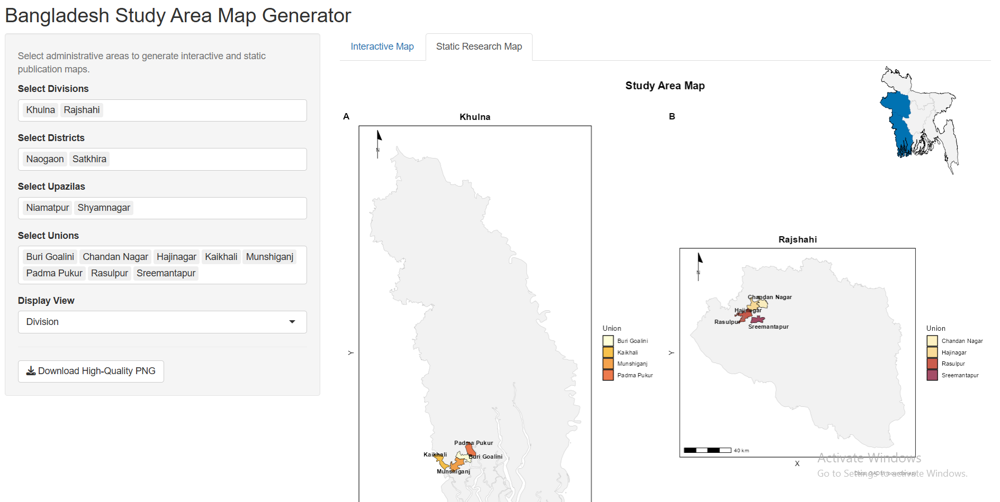
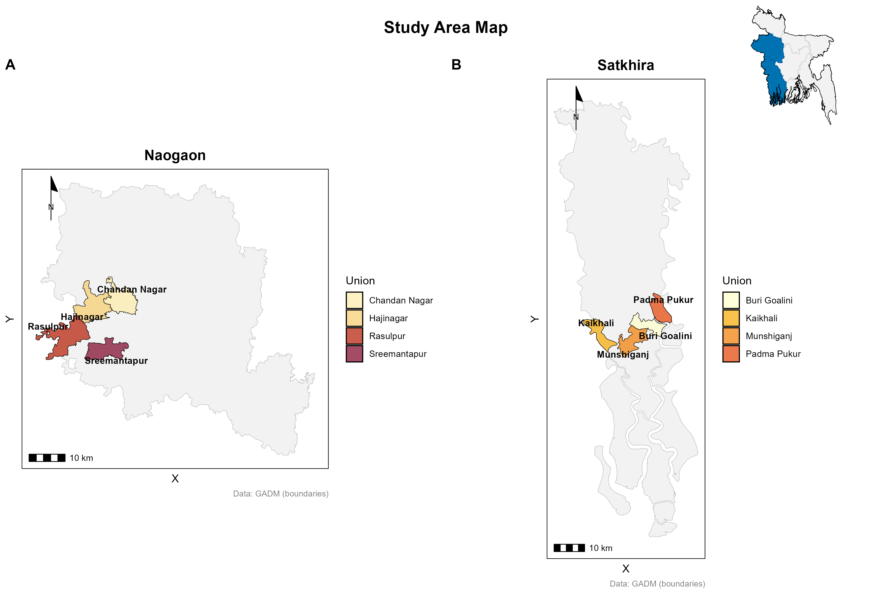

# Bangladesh Study Area Map Generator (Shiny App)

**Author:** Ashiqur Rahman Rony  
**Optimized by:** GPT-5 

---

## 🗺️ Overview

**Bangladesh Study Area Map Generator** is a simple and efficient **R Shiny app** designed to help you quickly create, visualize, and export study area maps for Bangladesh.  
Whether you are a researcher, student, or GIS analyst, this tool lets you select administrative regions (Division → District → Upazila → Union) and instantly generate high-quality maps for reports or publications.

---

## 🚀 Features

- ✅ **Interactive Map** – Explore Bangladesh’s administrative boundaries interactively using Leaflet.  
- ✅ **Custom Selection** – Filter by Division, District, Upazila, and Union.  
- ✅ **Static High-Quality Export** – Download publication-ready PNG maps using ggplot2 and viridis color schemes.  
- ✅ **Dynamic Labels** – Toggle place names on or off.  
- ✅ **Memory-Optimized** – Uses simplified geometries and caching for smooth performance, even on low-memory systems.  

---

## 🧩 Requirements

Before running the app, make sure you have the following installed:

### 🖥️ Software
- [R (version ≥ 4.2)](https://cran.r-project.org/)
- [RStudio](https://posit.co/download/rstudio/)

### 📦 Required R Packages
The app will automatically install missing packages using `pacman`, but you can install them manually if needed:

```r
install.packages(c(
  "shiny", "leaflet", "geodata", "elevatr", "terra", 
  "sf", "tidyverse", "classInt", "cowplot", "viridis", "ggplot2"
))
```

---

## ⚙️ How to Run

1. **Download or clone** this repository:
   ```bash
   git clone https://github.com/yourusername/bangladesh-study-area-map.git
   cd bangladesh-study-area-map
   ```

2. **Open** `app.R` in **RStudio**.

3. **Click “Run App”** (green triangle ▶️ in the top-right corner of the script editor).

4. The Shiny app will open in your default web browser.  
   From there:
   - Select your **Division**, **District**, **Upazila**, or **Union**.
   - Toggle labels if desired.
   - View the **Interactive Map** or switch to **Static Map**.
   - Click **Download Map (PNG)** to export a high-quality static image.

---

## 🗂️ Output Example

- Example output: a map of selected upazilas or unions, styled with `viridis` colors and white borders.
- The static map is suitable for inclusion in reports, research papers, or presentations.

---

## 🧠 Notes

- Administrative boundary data is sourced via the **GADM dataset** through the `geodata` package.  
- Geometries are simplified using `st_simplify()` to optimize performance while preserving visual fidelity.  
- The app uses a **Lambert Equal Area projection** for accurate spatial representation.

---

## 📸 Screenshot
### Screenshot 1:

### Screenshot 2:


---

## 📜 License

This project is released under the **MIT License** – feel free to modify and use it for your research or academic work.

---

## 💬 Citation

If you use this tool in your research or report, please cite as:

> Ashiqur Rahman Rony. (2025). *Bangladesh Study Area Map Generator (Shiny App).* GitHub Repository.

---

## 🤝 Acknowledgements

- **R Shiny** for interactive web application framework  
- **GADM / geodata** for administrative boundary data  
- **Viridis** for beautiful and perceptually uniform color palettes  
- **GGPlot2** and **Leaflet** for visualization power  

---

### 🧭 Quick Summary

> **When you need a quick, customizable, and high-quality study area map of Bangladesh, this app is your go-to solution.**
